# Unpaired Image-to-Image translation via Neural Schrödinger Bridge
In this project a re-implementation of the methods proposed in the paper "[Unpaired Image-to-Image Translation via Neural Schrödinger Bridge](https://arxiv.org/abs/2305.15086)" is presented. 

## Project description 
The original paper introduces a novel approach to address the limitations of traditional diffusion models in unpaired image-to-image (I2I) translation tasks. Diffusion models, which are generative models simulating stochastic differential equations (SDEs), often rely on a Gaussian prior assumption, which may not be suitable for all types of data distributions.

The Schrödinger Bridge (SB) concept provides an effective method by training an SDE to transform between two distinct distributions. This approach incorporates sophisticated discriminators and regularization methods, enhancing the model's capability to efficiently translate between unpaired datasets.

The re-implementation aims to explore the scalability and efficiency of UNSB, demonstrating its capability to perform various unpaired I2I translation tasks, particularly focusing on high-resolution images where previous SB models have faced challenges.

## Dataset 
For our image translation experiments, we have selected the horse2zebra dataset. It's divided in 2 main domains: domain A for horses and domain B for zebras.
<p align="center">
  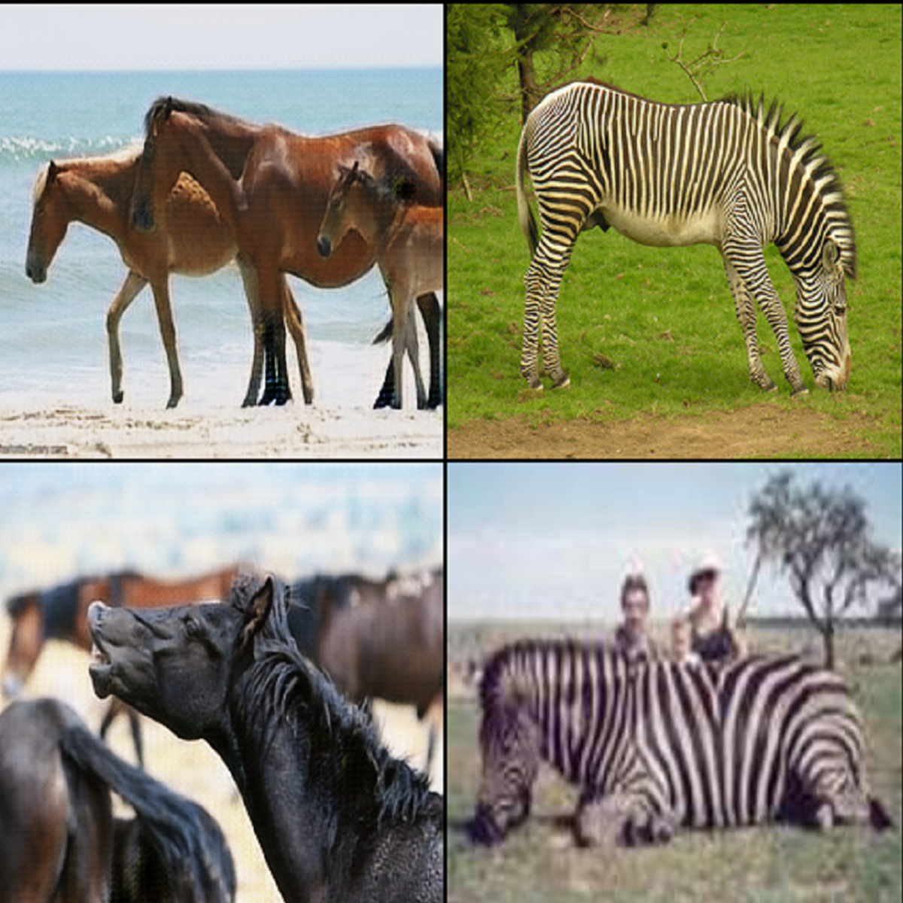
</p>
Due to limited computational resources, we opted to train the model on a smaller subset of the original dataset. 
Specifically:

- **Training Datasets**: each of the horse and zebra categories in the training set contains 200 images, totaling 400 images for model training. 
- **Testing Datasets**: for testing, each category—horse and zebra—includes 120 images. 

The selection of these subsets was aimed at maintaining a diverse representation of images to ensure that the model can still learn to generalize well across different types of input. 

## Architecture
The model exhibits a complex structure tailored for generating high-quality images while ensuring that the generated content remains diverse and adheres closely to the real data distribution.

The goal is to start from an image of an horse and generate the same image but with features of a zebra. 

Unlike traditional GANs, it uses a form of the diffusion process, which involves gradually transforming a sample from a simple distribution into a complex data distribution over multiple time steps. 

Schrödinger Bridge is used to guide this diffusion process such that it not only generates images by removing noise but does so by following the most probable path under the constraints of starting with a noise distribution and ending with a data distribution. 

The model is made by several sub-networks including multiple discriminators and generators, which likely serve different purposes such as handling different aspects of the image data and ensuring diverse capabilities within the model.

Below there's a graphical representation of the reimplemented network structure:
<p align="center">
  
</p>

## Repository Content
* **`extras`**: contains additional networks that were developed during the re-implementation of the paper so to experiment several techniques

* **`horse2zebra`**: this folder contains sub-folders used to train and test the model

* **`images`**: stores image files used in the project, such as generated images and evaluation plots

* **`models`**: all sub-networks and models needed to achieve our task

* **`options`**: parsers for both train and test so to adjust parameters when needed

* **`preprocessing`**: scripts dedicated to data cleaning, transformation, and preparation 

* **`utils`**: utility scripts to be used during evaluation stage

* **`nn-unsb.ipynb`**: our runnable notebook. It contains all sub-networks and models used to complete the required task. It was trained and tested on "kaggle" using GPU-P100. To visualize all images contained in it it's better to open it in local on Visual Studio Code.

* **`test.py`**: script to test the model 

* **`train.py`**: script to train the model


## Installation 

1. Clone the repository:
   ```bash
    git clone https://github.com/FrancescoSpena/UNSB
    cd UNSB
    ```
2. Create and activate a virtual environment:
    ```bash
    python3 -m venv UNSB-env
    source UNSB-env/bin/activate
    ```
3. Install requirements:
   ```bash
   pip install -r requirements.txt
    ```

## Run the Code 

### Training
To run the training script with default parameters, simply execute the following command:

```bash
python3 train.py
```

You can also customize the training process by specifying command-line arguments. Here are some of the parameters you can adjust in train_options.py:
- **dataroot**: it contains the path to the images of our dataset
- **path_trainA**: path to train dataset A (default is our samller version)
- **path_trainB**: path to train dataset B (default is our samller version)
- **path_testA**: path to test dataset A 
- **path_testB**: path to test dataset B
- **batch_size**: set to 1 by default
- **total_iters**: Total number of iterations (default is 0)
- **optimize_time**: Time for optimization (default is 0.1)
- **epoch_count**: Starting count of epochs (default is 1)
- **n_epochs**: Number of epochs (default is 90)
- **n_epochs_decay**: Number of decaying epochs (default is 90)
- **print_freq**: Frequency of printing outputs (default is 100)
- **gpu_ids**: List of GPU IDs for training (default is 1)
- **create_dir**: Directory to create to store output images

For example, to run the script on GPUs 0 and 1 for 100 epochs, use:
```bash
python3 train.py --gpu_ids 0 1 --n_epochs 100
```

### Testing
To run the test script with default parameters, simply execute the following command:

```bash
python3 test.py
```
The script uses a pre-configured argument parser (test_parser) from options.test_options, which includes the following parameters:
- **dataroot**: it contains the path to the images of our dataset
- **path_testA**: path to test dataset A 
- **path_testB**: path to test dataset B
- **num_threads**: Fixed at 0, indicating single-threaded operation.
- **batch_size**: Fixed at 1, as the test setup is designed for single-instance evaluation.
- **serial_batches**: Ensures the data is processed in the order it is provided (True by default).
- **no_flip**: Ensures no flipping augmentation is applied to the data (True by default).
- **aspect_ratio**: Configurable through command line to adjust the aspect ratio of the output images.
You can adjust their values by passing them as a command-line argument.
- **create_dir**: Directory to create to store output images

For example, to set the aspect ratio to 1.5, you would use:
```bash
python3 test.py --aspect_ratio 1.5
```

**Warning**: the model was trained and tested on "kaggle" by using GPU-P100, so it's better to run directly the notebook provided in the repository

## Results 
### Quantitative Results
#### Results on 200 epochs:
|          | FID                | KID                |
|------------|--------------------|--------------------|
| Train | 195.77 | 0.135 |
| Test  | 120.06 | 0.089 |

Plotting FID, KID and losses for training:
<p align="center">
  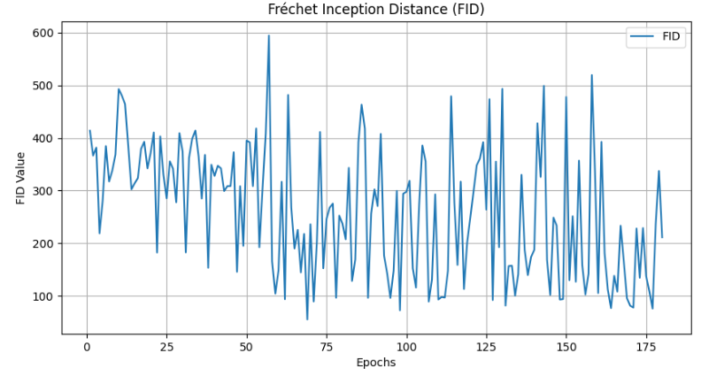
  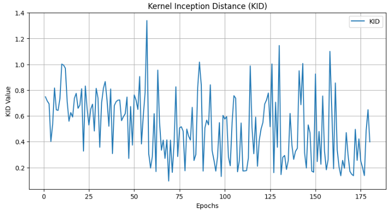
  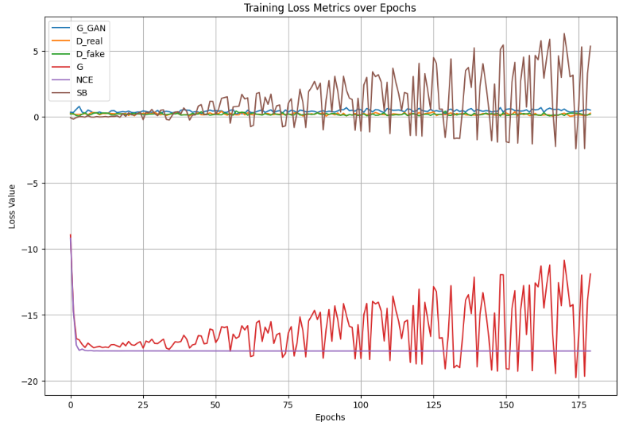
</p>

Plotting FID and KID for testing:
<p align="center">
  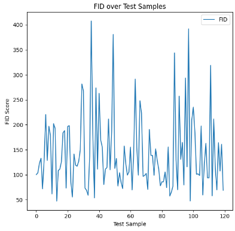
  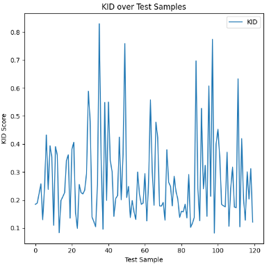
</p>

#### Results on 400 epochs:
|          | FID                | KID                |
|------------|--------------------|--------------------|
| Train | 197.76 | 0.131 |
| Test  | 101.70 | 0.082 |

Plotting FID, KID an losses for training:
<p align="center">
  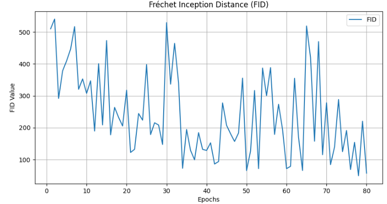
  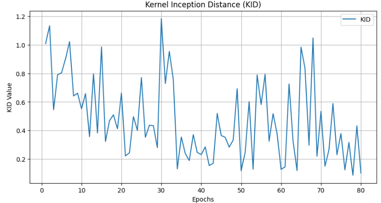
  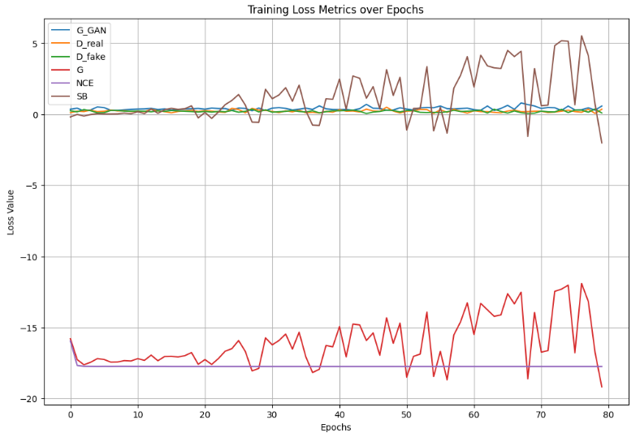
</p>

Plotting FID and KID for testing:
<p align="center">
  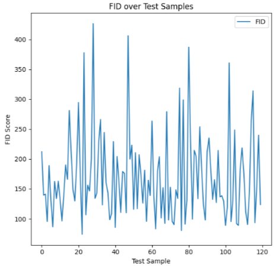
  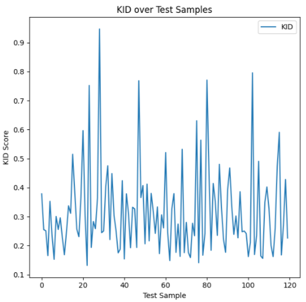
</p>

### Qualitative Results
Qualitative Results on 200 epochs:
<p align="center">
  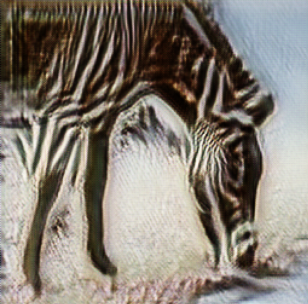
  
  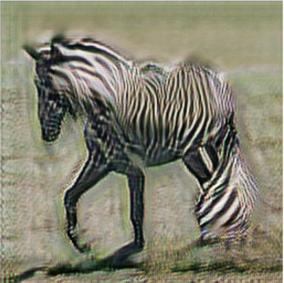
</p>

Qualitative Results on 400 epochs:
<p align="center">
  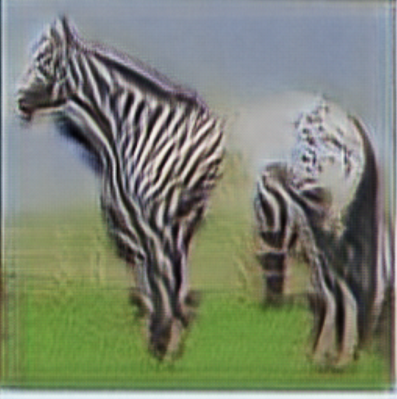
  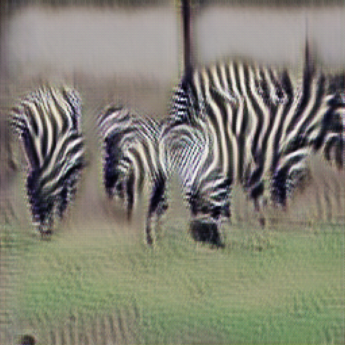
  
</p>

## Final Obervations
From the obtained results we realized that increasing the number of images in the dataset also increases the computational time per epoch. With 200 images for trainA and trainB, each epoch took approximately 220 seconds. With 400 images for trainA and trainB, each epoch took about 440 seconds. Given that we had only 12 hours to run a notebook on Kaggle, we decided to limit the number of epochs accordingly.

Although a larger dataset allows for faster convergence, we achieved good results despite running fewer epochs than the 400 epochs used in the original paper, which utilized the entire dataset.

## Acknowledgments
* The original paper:

```bib
@InProceedings{
  kim2023unsb,
  title={Unpaired Image-to-Image Translation via Neural Schrödinger Bridge},
  author={Beomsu Kim and Gihyun Kwon and Kwanyoung Kim and Jong Chul Ye},
  booktitle={ICLR},
  year={2024}
}
```
